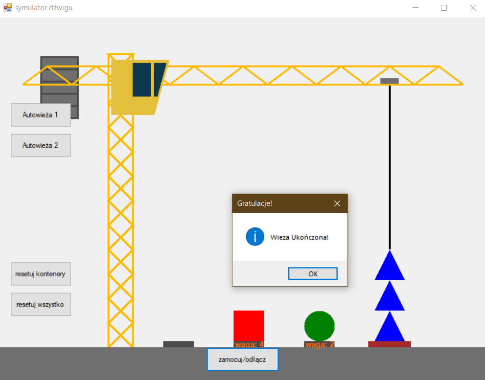

# Projekt 4
## Michał Stępski 204162
## Wiktor Woźniak 203819

### Zadanie 4- dźwig

* Po uruchomieniu program generuje okno z dźwigiem, trzema kontenerami na których stoją obiekty o losowo wygenerowanym kształcie oraz wadze, oraz podstawą do budowy wieży.
  
* Liną z hakiem można poruszać przy pomocy klawiszy `WASD` a elementy z kontenerów mocować do niej przy użyciu przycisku `zamocuj/odłącz`.

  - **UWAGA:** Odłączenie elementu od liny w miejscu innym niż pezpośrednio nad podstawą/elementem wieży powoduje jego "spadnięcie poza kadr".
* Przycisk `resetuj kontenery` generuje nowe loseowe elementy na kontenerach.

* Przycisk `resetuj wszystko` przywraca program do stanu aktwacji, z nowymi losowymi obiektami na kontenerach.
  
Poniższe funkcjonalności spełniają kryteria 4.1-4.3:
* Pierwszy po uruchomieniu/resecie zamocowany do haka obiekt decyduje o typie obiektu, który może podnieść dźwig i w standardowym trybie działania przy próbie podniesienia obiektu o innym kształcie pojawi się komunikat błędu.

* Po ułożeniu na podstawie wieży z trzech elementów pojawi się komunikat:

* W przypadku próby położenia na wieży kolejnego elementu pojawi się komunikat błędu.

* Obiekty mogą przyjmować wagę od 0 do 6. Dźwig jest w stanie podnieść tylko elementy o wadze mniejszej niż 6, spełniając tym samym kryterium 4.4. W przypadku próby podniesienia elemetu o wadze 6 pojawia się komunikat błędu.

Kryteria 4.5 oraz 4.6 są spełniane odpowiednio dzięki przyciskom `Autowieża 1` i `Autowieża 2`.
* Po wciśnięciu oba przyciski powodują reset, oraz generację konkretnych, wcześniej ustalonych obiektów.

* Przycisk `Autowieża 1` ruch po ruchu konstruuje wieżę w kolejnościk kwadrat->trójkąt->koło.

* Przycisk `Autowieża 2` ruch po ruchu konstruuje wieżę w kolejności koło->kwadrat->trójkąt.

